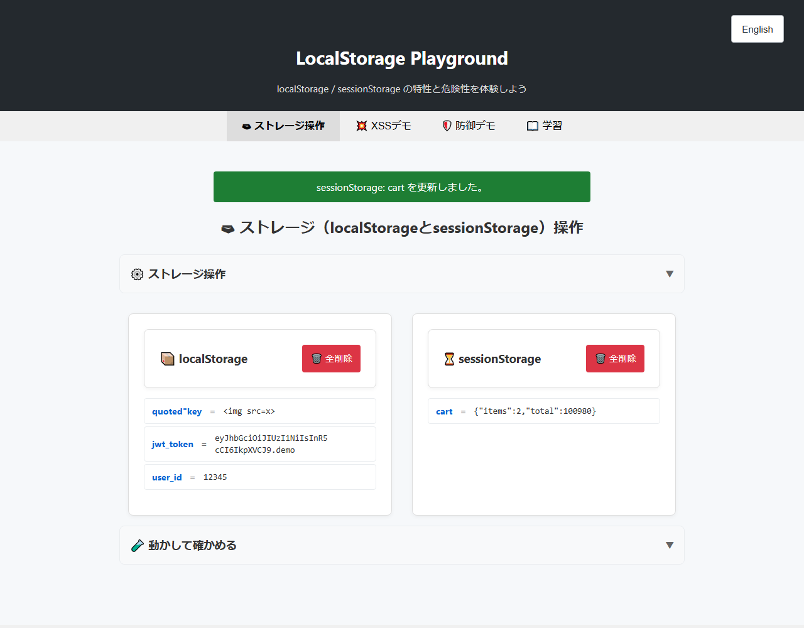
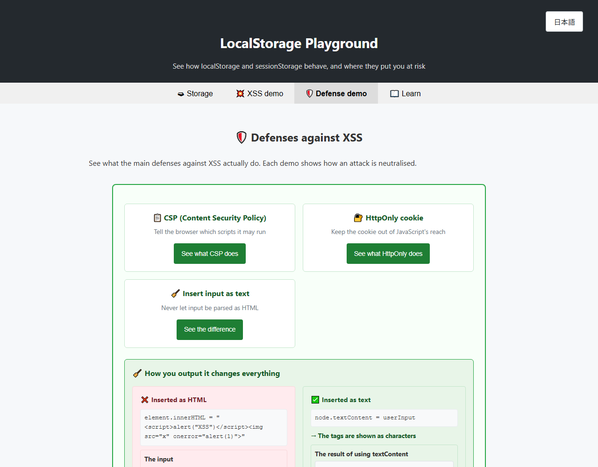

# LocalStorage Playground - Learn where Web Storage stops protecting you

English · [日本語](README.md)


[](https://ipusiron.github.io/localstorage-playground/)

**Day038 - 100 Security Tools with Generative AI**

**LocalStorage Playground** lets you find out, by hand, how far `localStorage` and `sessionStorage` protect what you put in them, and where that protection stops.

It runs entirely in the browser. There is nothing to install and no server to run. Whatever you store stays in your own browser and is never sent anywhere.

## 🔗 Demo

👉 **[https://ipusiron.github.io/localstorage-playground/](https://ipusiron.github.io/localstorage-playground/)**

## 📸 Screenshots



*What is stored, split between localStorage and sessionStorage*



*English view. The same input, inserted two different ways, side by side*

## 🎯 What you can do

### Work with the storages

- List what is in `localStorage` and `sessionStorage`, side by side
- Add, edit and delete keys and values
- Clear one storage, or both
- Filter by key and value, or by type (string, JSON, number, boolean, URL, email)
- See how many bytes are in use, and measure the actual size limit
- Export the contents as JSON or CSV (the file is built in the browser)
- Load sample data sets for practice

### See what XSS can take

- Pick an attack scenario from three levels (basic, broader, persistent)
- Run the chosen script with outgoing requests blocked
- Compare the storage before and after the run
- Count how many times it tried to send data out (nothing is actually sent)

### See what each defense really does

- CSP (Content Security Policy)
- HttpOnly cookies
- Inserting input as text rather than as HTML

Each one shows the "without" and "with" cases side by side, and states **what that defense still leaves open**.

### Read how it works

- A comparison of `localStorage`, `sessionStorage` and HttpOnly cookies
- Why secrets do not belong in Web Storage

## 🌐 Japanese and English

Use the button at the top right. The language is decided in this order:

1. `?lang=ja` or `?lang=en` in the URL
2. The setting you chose last time (stored in localStorage under `localstorage-playground:lang`)
3. Your browser's language setting

The setting is not hidden: it appears in the list like any other entry. That the tool's own preference also lives in localStorage is itself part of the lesson.

Switching reloads the page, but **the tab you were on and the text you had typed are kept**. They travel in `window.name`, so nothing is added to the storages you are inspecting.

## 🔐 How this tool protects itself

A tool that teaches about injection has no business being injectable. So:

- Input from the user (keys, values, search terms) is **never assembled into an HTML string**. Everything is displayed with `textContent` and `createElement`
- No inline `onclick` and no `style` attributes
- The CSP allows neither `script-src 'unsafe-inline'` nor `style-src 'unsafe-inline'`
- `connect-src 'none'` and `object-src 'none'` block outgoing requests and embedded objects
- No external CDN, font or API is loaded

The one exception is `'unsafe-eval'` in `script-src`, because the XSS demo runs the script you type through `eval`. While it runs, `fetch`, `XMLHttpRequest`, `WebSocket`, `Image` and `navigator.sendBeacon` are replaced with blocking versions, and they are always restored afterwards, including when the script throws. See [SECURITY.md](SECURITY.md) for the details.

## 📛 Security background

The attacks you can reproduce here, real-world incidents and the recommended countermeasures are covered separately.

👉 **[Security risks and countermeasures](SECURITY.md)**

## 🧪 Tests

There are no dependencies. Node.js 22 or later is required.

```bash
npm test
```

33 tests check that:

- User input is never mixed into HTML strings or event attributes
- No inline handlers, `style` attributes, unnecessary `'unsafe-inline'`, external resources or network calls have crept in
- The XSS demo always restores the APIs it replaced
- Tabs, dialogs, labels, `button` types, the CSP and `lang` are wired correctly
- The Japanese and English dictionaries have the same keys, no empty values and matching placeholders
- No display text is hard-coded inside the modules

`.github/workflows/test.yml` runs the same tests on every push and pull request.

## 📂 Directory structure

```
localstorage-playground/
├── index.html                # Page skeleton; text is bound to the dictionary via data-i18n
├── style.css                 # Styles (narrow screens and dark mode)
├── main.js                   # Startup: initialises the modules and the language switch
├── modules/
│   ├── i18n.js               # The Japanese and English dictionary, and language handling
│   ├── tabs.js               # Tab switching and keyboard navigation
│   ├── storage.js            # Storage operations (add, edit, delete, search)
│   │                         # capacity stats, export, sample data, hands-on checks
│   ├── xss.js                # XSS demo (scenarios, blocking, impact analysis)
│   ├── defense.js            # Defense demos (CSP, HttpOnly, safe output)
│   └── learn.js              # Explanatory content and the comparison table
├── test/
│   ├── foundation.test.js    # How the scripts load, and the basis for safe display
│   ├── storage-safety.test.js # Handling of input and of storage monitoring
│   ├── markup-csp.test.js    # CSP, markup and accessibility
│   ├── i18n.test.js          # The dictionaries and the absence of hard-coded text
│   └── docs.test.js          # Consistency of README and SECURITY.md
├── .github/workflows/test.yml # Runs the tests on push and pull request
├── package.json              # Just calls node --test; no dependencies
├── CLAUDE.md                 # Working notes for this repository
├── README.md                 # Japanese version
├── README.en.md              # This document
├── SECURITY.md               # Security risks and countermeasures
├── LICENSE                   # MIT License
└── assets/
    ├── screenshot.png        # Screenshot of the Japanese view
    └── en/
        └── screenshot.png    # Screenshot of the English view
```

## ⚙️ Requirements

- A recent version of Chrome, Edge, Firefox or Safari
- No build step. Open `index.html` directly, or serve it over local HTTP
- Node.js 22 or later is needed to run the tests, not to use the tool

Everything also works when the page is opened over `file://`. Bear in mind that browsers treat origins differently for `file://`, so the same-origin demonstration is closer to reality over HTTP.

## 📄 License

MIT License - see [LICENSE](LICENSE) for details.

## 🛠 About this tool

This tool was built as part of the "100 Security Tools with Generative AI" project, in which a security-related tool is created and published each day for 100 days, with the help of generative AI.

For the project and the other tools, see:

🔗 [https://akademeia.info/?page_id=42163](https://akademeia.info/?page_id=42163)
