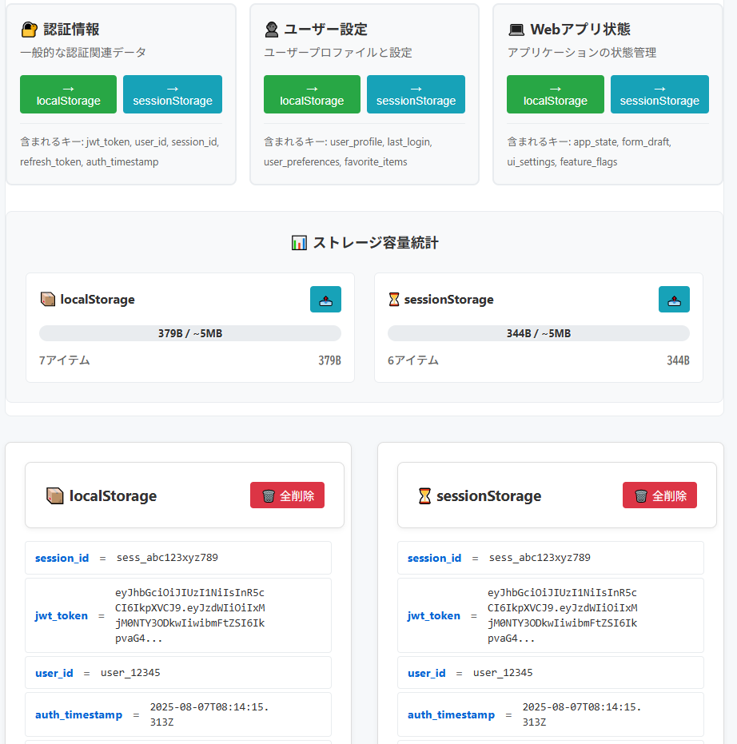

# LocalStorage Playground - Webストレージの危険性の学習・体験ツール


[](https://ipusiron.github.io/localstorage-playground/)

**Day038 - 生成AIで作るセキュリティツール100**

**LocalStorage Playground** は、WebStorageのセキュリティリスクを実践的に学習できる教育ツールです。

本ツールは、以下の3つの特徴を備えています。

- XSS攻撃の実行と防御を安全に体験
- ブラウザストレージの脆弱性を視覚的に理解  
- 企業研修・個人学習・授業で即座に利用可能

---

## 🚀 デモページ

👉 **[https://ipusiron.github.io/localstorage-playground/](https://ipusiron.github.io/localstorage-playground/)**

---

## 👥 対象者

- **Web開発者**
- **セキュリティ担当者**
- **学習者**  

前提知識：JavaScript基礎（推奨）

## 📸 スクリーンショット

>   
>
> *ストレージに認証情報をセット*

---

## 🎯 主な機能

### 📊 ストレージ管理機能
- `localStorage` / `sessionStorage` に保存されたデータの一覧表示
- 任意のキー・値の追加・編集・削除
- ストレージのクリア機能（片方または両方）
- 容量統計の表示とブラウザークォータチェック（モーダル表示）
- データのエクスポート機能（JSON形式、日本時間タイムスタンプ付きファイル名、💾アイコン）
- プリセットデータの自動生成
- リアルタイムデータ更新と検索・フィルタリング

### 🎯 XSS攻撃デモ
- 基本的な攻撃（トークン窃取、セッションデータ窃取）
- 高度な攻撃（全データ列挙、JSON一括取得）
- 持続的攻撃（マルウェア埋め込み、外部送信攻撃）
- 攻撃シナリオ選択UI
- セキュリティ影響分析とステップ表示

### 🛡️ 防御デモンストレーション
- CSP（Content Security Policy）の効果確認
- HttpOnly Cookieの防御力比較
- 入力サニタイゼーション前後の比較

### 📚 学習コンテンツ
- `localStorage` と `sessionStorage` の違いを視覚的に比較
- セキュリティ警告の表示（アクセス可能性・XSS盗難リスク）
- ベストプラクティスとセキュアな実装例

---

## 📛 セキュリティリスク情報

本ツールで体験できるXSS攻撃シナリオ、実際の被害例、推奨される防御策については、以下のリンク先で詳しく解説しています。

👉 **[セキュリティリスクと対策の詳細](SECURITY.md)**

---

## 📁 ディレクトリー構成

```
localstorage-playground/
├── index.html                # メインHTMLファイル
├── style.css                 # CSSスタイル（レスポンシブ・ダークモード対応）
├── main.js                   # エントリーポイント（ES6モジュール）
├── modules/                  # 機能別モジュール
│   ├── tabs.js               # タブ切り替え管理
│   ├── storage.js            # ストレージ操作（メイン機能）
│   │                         # - 容量統計・エクスポート・編集・削除
│   │                         # - プリセットデータ・検索・フィルタリング
│   │                         # - リアルタイム更新・インタラクティブテスト
│   ├── xss.js                # XSS攻撃デモ機能
│   │                         # - 攻撃シナリオ分類（基本・高度・持続的）
│   │                         # - セキュリティ影響分析・実行ステップ表示
│   ├── defense.js            # 防御デモンストレーション
│   │                         # - CSP・HttpOnly・サニタイゼーション実演
│   └── learn.js              # 学習コンテンツ（比較表・ベストプラクティス）
├── CLAUDE.md                 # 開発ドキュメント（Claude向け）
├── README.md                 # プロジェクト説明書
├── SECURITY.md               # セキュリティリスクと対策（詳細版）
├── LICENSE                   # MITライセンス
└── assets/                   # 静的リソース
    └── screenshot.png        # デモスクリーンショット
```

---

## 📄 ライセンス

MIT License - 詳細は [LICENSE](LICENSE) をご覧ください。

---

## 🛠 このツールについて

本ツールは、「生成AIで作るセキュリティツール100」プロジェクトの一環として開発されました。 このプロジェクトでは、AIの支援を活用しながら、セキュリティに関連するさまざまなツールを100日間にわたり制作・公開していく取り組みを行っています。

プロジェクトの詳細や他のツールについては、以下のページをご覧ください。

🔗 [https://akademeia.info/?page_id=42163](https://akademeia.info/?page_id=42163)
